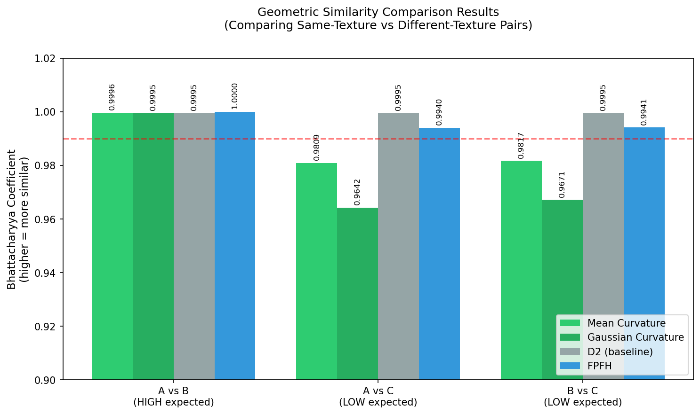

# Point Cloud Geometric Similarity

**Pose-invariant geometric similarity comparison for 3D point clouds using curvature distributions. No training data required.**

[](https://www.python.org/downloads/)
[](https://opensource.org/licenses/MIT)

---

## Overview

This programme compares the geometric similarity of 3D surface-texture point clouds using **intrinsic geometric properties** — primarily curvature distributions. Unlike alignment-based methods (e.g., ICP) or learning-based approaches, this method is:

- **Pose-invariant**: Rotation and translation do not affect results
- **Density-robust**: Works across different point densities
- **Training-free**: No machine learning or pre-existing datasets required
- **Interpretable**: Based on well-understood differential geometry

The primary application is **surface texture comparison** in precision manufacturing, quality inspection, and coordinate metrology — though the approach generalises to any domain requiring geometric comparison of unaligned point clouds.

---

## Background and Motivation

This programme is a replacement and upgrade of a critical component in the data fusion pipeline proposed in my PhD thesis (*A data fusion pipeline for registering point clouds with novel characteristics: enabling the computer to recognise a pattern without training dataset*, University of Nottingham, 2024).

### The Original Approach

The original method for comparing the geometric similarity of two 3D surface-texture point clouds with different point densities was a **spatial brute-force** approach:

1. Voxelise the 3D space mutually occupied by the two point clouds
2. Count the points from each cloud falling into each voxel
3. Convert counts to percentages relative to the total number of points in each cloud
4. Compare voxels with similar percentages across the two clouds
5. Higher number of matched voxels → higher similarity

### Limitations of the Original Method

This voxelisation-counting method, while conceptually straightforward, has significant practical limitations:

| Limitation | Description |
|------------|-------------|
| **Orientation dependence** | Results vary with the relative orientation of the two clouds. To find the best match, one cloud must be rotated about an axis through numerous angles — and even then, the chosen axis may not align with the principal geometric axis of the other cloud, potentially yielding zero matched voxels for genuinely similar surfaces. |
| **Computational cost** | The exhaustive rotation search is time-consuming, particularly for dense point clouds. |
| **Sensitivity to noise** | The target application — recognising similar surface textures on engineered components in aerospace and advanced manufacturing — involves surfaces where height fluctuations (the "altitude" of surface features) are extremely small relative to the lateral (x-y) extent of the point cloud. Measurement noise hovering above the true surface can dominate the voxel counts, leading to anomalous comparison results. |

### The New Approach

This programme proposes a fundamentally different method based on **curvature distributions**. Rather than comparing spatial occupancy (which is pose-dependent), we compare the **intrinsic geometry** of each surface — specifically, how "curved" the surface is at every point.

Key insight: **Curvature is an intrinsic property.** It depends only on the local shape of the surface, not on how the surface is oriented in 3D space. Two point clouds representing the same texture will have the same distribution of curvatures, regardless of their relative pose.

This approach is more robust, more efficient, and better suited to industrial practice and R&D environments where ease of use and reliability are paramount.

---

## Methods Implemented

### Primary Method: Curvature Distributions

At each point, the algorithm estimates:

- **Mean curvature** $H = \frac{1}{2}(\kappa_1 + \kappa_2)$
- **Gaussian curvature** $K = \kappa_1 \cdot \kappa_2$

where $\kappa_1$ and $\kappa_2$ are the principal curvatures obtained via local quadric surface fitting.

The distributions of $H$ and $K$ are compared using histogram-based metrics:

| Metric | Interpretation |
|--------|----------------|
| Bhattacharyya coefficient | 1.0 = identical distributions |
| Histogram intersection | 1.0 = complete overlap |
| Jensen-Shannon divergence | 0.0 = identical distributions |
| Earth Mover's Distance | 0.0 = identical distributions |

### Supporting Methods

| Method | Role |
|--------|------|
| **D2 Shape Distribution** | Baseline comparison using pairwise point distances. Included to demonstrate why simple statistical methods fail for subtle surface textures. |
| **FPFH (Fast Point Feature Histograms)** | Cross-validation using an established descriptor from the computer vision literature. |

---

## Results

Tested on synthetic engineered surfaces with controlled texture parameters:

| Comparison | Mean Curvature | Gaussian Curvature | D2 | FPFH |
|------------|----------------|--------------------|----|------|
| A vs B (same texture, different density) | **0.9996** | **0.9995** | 0.9995 | 1.0000 |
| A vs C (different texture) | 0.9809 | 0.9642 | 0.9995 | 0.9940 |
| B vs C (different texture) | 0.9817 | 0.9671 | 0.9995 | 0.9941 |

*Values are Bhattacharyya coefficients (higher = more similar)*

**Key findings:**

1. **Curvature-based methods correctly discriminate** same-texture pairs (0.999+) from different-texture pairs (0.96–0.98)
2. **D2 fails** — all comparisons score ~0.9995, demonstrating that simple pairwise distances cannot capture subtle texture differences
3. **Gaussian curvature provides the strongest discrimination** (largest gap between same-texture and different-texture pairs)

### Visualisation

<p align="center">
  
</p>

*Mean and Gaussian curvature distributions for three test surfaces. Clouds A and B (same texture, different densities) show nearly identical distributions, while Cloud C (different texture) is clearly distinguishable.*

<p align="center">
  
</p>

*Comparison of all methods. Curvature-based methods (green) successfully separate same-texture from different-texture pairs. D2 baseline (grey) fails to discriminate.*

---

## Installation

```bash
git clone https://github.com/[your-username]/pointcloud-geometric-similarity.git
cd pointcloud-geometric-similarity
pip install -r requirements.txt
```

### Dependencies

- Python 3.8+
- NumPy
- SciPy
- Matplotlib

---

## Usage

### Generate Synthetic Test Data

```python
from surface_pointcloud_generator import generate_test_set

# Creates three point clouds:
# - Cloud A: High density, Texture 1
# - Cloud B: Low density, Texture 1 (same texture as A)
# - Cloud C: Low density, Texture 2 (different texture)
cloud_a, cloud_b, cloud_c = generate_test_set()
```

### Compare Point Clouds

```python
from geometric_similarity import compare_point_clouds, print_comparison_summary

# Load your point clouds (Nx3 numpy arrays)
# points1, points2 = ...

results = compare_point_clouds(
    points1, points2,
    name1="Surface A",
    name2="Surface B",
    methods=['curvature', 'd2', 'fpfh']  # or just ['curvature']
)

print_comparison_summary(results, "A", "B")
```

### Run Full Test Suite

```bash
python geometric_similarity.py
```

This will:
1. Load the synthetic test point clouds
2. Run all comparison methods
3. Print a summary of results

---

## Project Structure

```
pointcloud-geometric-similarity/
├── README.md
├── requirements.txt
├── .gitignore
├── LICENSE
│
├── surface_pointcloud_generator.py    # Synthetic surface generation
├── geometric_similarity.py            # Core comparison algorithms
├── visualize_surfaces.py              # Point cloud visualisation
├── visualize_similarity.py            # Results visualisation
│
├── data/                              # Generated point cloud data
│   ├── cloud_A_high_density_texture1.ply
│   ├── cloud_A_high_density_texture1.csv
│   ├── cloud_B_low_density_texture1.ply
│   ├── cloud_B_low_density_texture1.csv
│   ├── cloud_C_low_density_texture2.ply
│   └── cloud_C_low_density_texture2.csv
│
└── results/                           # Output figures
    ├── visualization.png
    ├── comparison.png
    ├── curvature_distributions.png
    ├── curvature_comparison_overlay.png
    ├── curvature_maps.png
    ├── similarity_summary.png
    └── results_table.png
```

---

## Technical Details

### Surface Generation Model

Synthetic surfaces are generated as Gaussian random fields with exponential autocorrelation:

$$R(\tau_x, \tau_y) = \sigma^2 \cdot \exp\left( -\frac{|\tau_x|}{\lambda_x} - \frac{|\tau_y|}{\lambda_y} \right)$$

where $\lambda$ is the correlation length controlling texture feature size. Generation uses FFT-based spectral synthesis (see `surface_pointcloud_generator.py` for implementation details).

### Curvature Estimation

1. **Normal estimation**: PCA on k-nearest neighbours (default k=30)
2. **Local surface fitting**: Quadric fit $z = ax^2 + bxy + cy^2 + dx + ey + f$ in local tangent-plane coordinates
3. **Principal curvatures**: Eigenvalues of the shape operator
<div align="center">

$$
\begin{pmatrix} 
2a & b \\ 
b & 2c 
\end{pmatrix}
$$

</div>
### Why Curvature Works for Surface Textures

A finer texture (smaller correlation length $\lambda$) has more frequent peaks and valleys, resulting in higher local curvatures and a wider curvature distribution. A coarser texture has gentler undulations and curvatures concentrated near zero. This difference is captured in the distribution shape, regardless of point cloud orientation or density.

---

## Potential Applications

- **Quality inspection**: Compare measured surfaces against reference CAD models or golden samples
- **Surface classification**: Identify machining process (ground, turned, milled) from surface texture
- **Registration pre-screening**: Quickly assess whether two point clouds are likely candidates for detailed alignment
- **Change detection**: Identify regions of wear or damage by comparing curvature distributions over time

---

## Limitations and Future Work

- **Computational cost**: Curvature estimation is O(n · k) where n = number of points and k = neighbourhood size. For very large clouds (>1M points), consider subsampling.
- **Noise sensitivity**: While more robust than voxelisation, curvature estimation can be affected by high measurement noise. Pre-filtering may be beneficial.
- **Isotropic assumption**: Current implementation assumes isotropic textures. Extension to anisotropic surfaces (e.g., turned surfaces with directional lay) would require directional curvature analysis.

---

## References

- ISO 25178: Geometrical product specifications — Surface texture: Areal
- Osada, R. et al. (2002). Shape Distributions. *ACM Transactions on Graphics*.
- Rusu, R.B. et al. (2009). Fast Point Feature Histograms (FPFH). *IEEE ICRA*.

---

## Author

Zhongyi Michael Zhang  
PhD, Manufacturing Engineering (Metrology)  
Institute for Advanced Manufacturing, University of Nottingham, 2025

---

## License

This project is licensed under the MIT License — see the [LICENSE](LICENSE) file for details.
